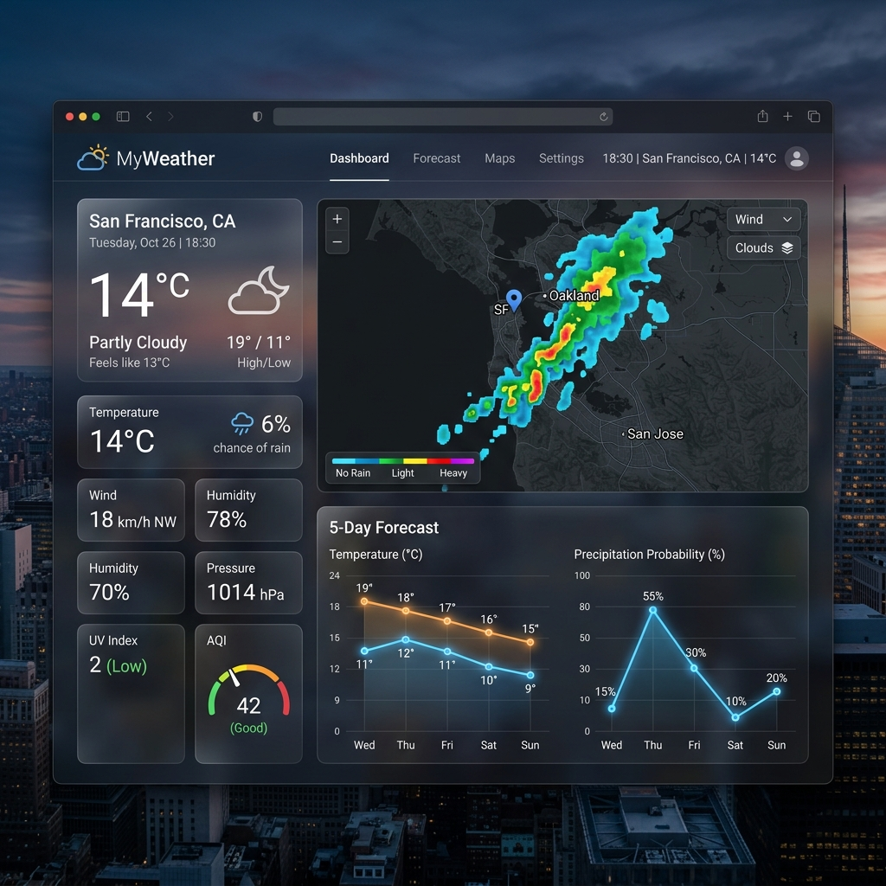
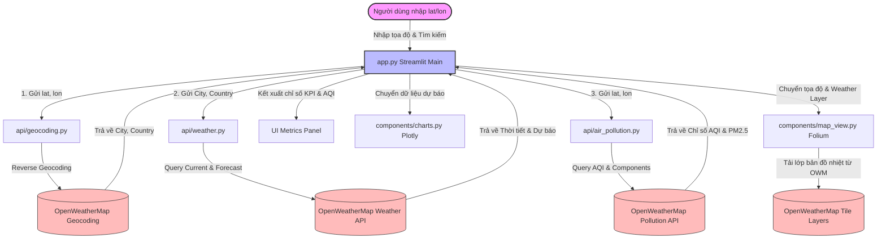

# 🌤️ MyWeather - Dashboard Dự Báo Thời Tiết Toàn Diện & Trực Quan

<!-- BANNER OR LOGO -->
<p align="center">
  
</p>

<p align="center">
  <b><i>Ứng dụng phân tích và trực quan hóa thời tiết thời gian thực đa chiều, tích hợp bản đồ khí hậu tương tác và biểu đồ xu hướng chuyên sâu.</i></b>
</p>

<p align="center">
  
  
  
  
  
  
</p>

---

## 🌟 Tổng Quan Dự Án (Overview)
**MyWeather** là một hệ thống Dashboard thông minh, tối giản nhưng vô cùng mạnh mẽ, được xây dựng trên nền tảng **Python** và **Streamlit**. Dự án cho phép người dùng truy xuất dữ liệu khí hậu thời gian thực tại bất kỳ tọa độ địa lý nào trên Trái Đất (lấy trực tiếp từ Google Maps) thông qua sự kết hợp hoàn hảo của bộ ba dịch vụ cốt lõi từ **OpenWeatherMap**:
1. **Current Weather Data**: Dữ liệu thời tiết hiện tại chính xác.
2. **5-Day / 3-Hour Forecast**: Dự báo khí hậu chi tiết trong 5 ngày tới với bước nhảy 3 giờ.
3. **Air Pollution API**: Chỉ số chất lượng không khí (AQI) và phân tích các hạt ô nhiễm mịn trong khí quyển.

Được hỗ trợ bởi các thư viện trực quan hóa hàng đầu như **Plotly** và **Folium**, MyWeather chuyển đổi các luồng dữ liệu thô (JSON) phức tạp thành những bản đồ nhiệt độ trực quan sinh động và các biểu đồ phân tích xu hướng trực quan sắc nét.

---

## 🚀 Tính Năng Nổi Bật (Key Features)

| Tính Năng | Mô Tả Chi Tiết | Công Nghệ Sử Dụng |
| :--- | :--- | :--- |
| **🔍 Định vị & Địa danh hóa** | Tự động chuyển đổi tọa độ địa lý (`lat`, `lon`) thành tên thành phố và quốc gia tương ứng thông qua tính năng Reverse Geocoding. | `OpenWeatherMap Geocoding API` |
| **🌡️ Metric Khí Hậu Tức Thời** | Hiển thị tức thời Nhiệt độ (°C), Cảm giác thực tế (Feels like), Độ ẩm (%), Tốc độ gió (m/s) và Tình trạng thời tiết tổng quan dạng text sống động. | `OpenWeatherMap Weather API` |
| **🌿 Đánh Giá Chất Lượng Không Khí** | Tính toán chỉ số AQI theo tiêu chuẩn Châu Âu kèm cảnh báo phân loại (Tốt, Khá, Trung bình, Xấu, Rất xấu) cùng nồng độ bụi mịn PM2.5. | `Air Pollution API` |
| **🗺️ Bản Đồ Khí Hậu Tương Tác** | Tích hợp bản đồ trực tuyến đa lớp. Cho phép chuyển đổi nhanh giữa các lớp dữ liệu phủ (Weather Layers): Nhiệt độ, Gió, Mây, Lượng mưa chồng lên bản đồ nền. | `Folium` & `streamlit-folium` |
| **📈 Biểu Đồ Phân Tích Xu Hướng** | Vẽ biểu đồ động dạng đường và dạng cột biểu thị xu hướng biến động nhiệt độ, tốc độ gió và độ ẩm 5 ngày tiếp theo, hỗ trợ tương tác thu phóng trực tiếp. | `Plotly Express` & `Pandas` |

---

## 🏗️ Kiến Trúc Hệ Thống (Architecture & Data Flow)

Hệ thống được thiết kế theo mô hình kiến trúc Module hóa tách biệt giữa **API Client** (Xử lý kết nối dịch vụ) và **UI Components** (Xử lý giao diện tương tác trực quan).

### 📂 Cấu trúc thư mục dự án
```text
my-weather/
├── .env                  # Tệp lưu trữ biến môi trường (API Key)
├── .gitignore            # Cấu hình bỏ qua tệp tin rác trong Git
├── LICENSE               # Giấy phép bản quyền mã nguồn mở (MIT)
├── app.py                # Điểm khởi chạy ứng dụng chính (Streamlit Entry Point)
├── requirements.txt      # Tệp kê khai toàn bộ thư viện phụ thuộc
├── MyWeather_Notebook.ipynb # Sổ tay Jupyter thử nghiệm API
├── api/                  # Gói xử lý giao tiếp mạng và API OpenWeatherMap
│   ├── __init__.py
│   ├── air_pollution.py  # Module truy vấn chất lượng không khí & AQI
│   ├── geocoding.py      # Module ánh xạ tọa độ địa lý sang tên địa phương
│   └── weather.py        # Module truy xuất thời tiết hiện tại và dự báo 5 ngày
├── components/           # Thư mục chứa các thành phần giao diện động
│   ├── __init__.py
│   ├── charts.py         # Trình biểu diễn biểu đồ thống kê xu hướng Plotly
│   └── map_view.py       # Trình kết xuất bản đồ nhiệt tương tác Folium
└── assets/               # Thư mục lưu trữ hình ảnh, tài nguyên giao diện
    └── dashboard_preview.png
```

### 🔄 Luồng xử lý dữ liệu (Data Flow Diagram)



---

## ⚡ Hướng Dẫn Cài Đặt Nhanh (Quick Start)

Làm theo các bước đơn giản sau để thiết lập dự án và chạy ứng dụng trên máy local của bạn:

### 1. Chuẩn bị mã nguồn
Tải mã nguồn về máy tính cá nhân bằng cách sao chép dòng lệnh dưới đây:
```bash
git clone https://github.com/username/my-weather.git
cd my-weather
```

### 2. Thiết lập môi trường ảo & Cài đặt thư viện
Khuyến nghị sử dụng môi trường ảo (`venv`) để tránh xung đột thư viện hệ thống:

**Trên Windows:**
```powershell
python -m venv venv
.\venv\Scripts\activate
pip install -r requirements.txt
```

**Trên macOS/Linux:**
```bash
python3 -m venv venv
source venv/bin/activate
pip install -r requirements.txt
```

### 3. Đăng ký & cấu hình OpenWeatherMap API Key
1. Truy cập trang web chính thức [OpenWeatherMap](https://openweathermap.org/) và đăng ký tài khoản miễn phí.
2. Điều hướng đến phần **My API Keys** để tạo mã khóa API cá nhân của bạn.
3. Tạo tệp `.env` tại thư mục gốc của dự án và dán khóa API của bạn vào đó:
```env
OWM_API_KEY=your_openweathermap_api_key_here
```

### 4. Khởi chạy ứng dụng Streamlit
Chạy lệnh khởi động máy chủ Streamlit cục bộ:
```bash
streamlit run app.py
```
Sau khi chạy thành công, giao diện ứng dụng sẽ tự động được mở trong trình duyệt mặc định của bạn tại địa chỉ: `http://localhost:8501`.

---

## 🔧 Mô Tả Chi Tiết Các Module Kỹ Thuật (Module Walkthrough)

### 🛰️ API Integration Layer (`api/`)
* **`geocoding.py`**: Nhận vào kinh độ và vĩ độ từ Google Maps, gửi truy vấn `reverse` geocoding lên dịch vụ để ánh xạ thông tin tọa độ thành một địa danh cụ thể trên bản đồ thế giới, giúp cải thiện đáng kể trải nghiệm người dùng so với nhập chữ thủ công.
* **`weather.py`**: Đầu mối liên lạc nhận tên thành phố và quốc gia từ Geocoding, thực hiện song song 2 yêu cầu HTTP: Lấy thời tiết hiện tại (`/weather`) và dữ liệu khí hậu dự báo định kỳ (`/forecast`) theo đơn vị độ C (Metric).
* **`air_pollution.py`**: Đảm nhận nhiệm vụ đo lường sức khỏe bầu không khí. Nó nhận vĩ độ và kinh độ, trả về điểm số AQI (1-5) tương ứng với các trạng thái từ Tốt tới Rất Xấu cùng lượng bụi mịn $PM_{2.5}$ tính theo $\mu g/m^3$.

### 🎨 UI Components Layer (`components/`)
* **`map_view.py`**: Tích hợp thư viện bản đồ Folium. Module tạo một bản đồ tương tác năng động tại tọa độ tìm kiếm, sau đó nạp động lớp phủ chứa bản đồ thời tiết (`TileLayer`) trực tiếp từ máy chủ OpenWeatherMap dựa trên chế độ lựa chọn của người dùng (Nhiệt độ, Mây, Lượng mưa, Tốc độ gió).
* **`charts.py`**: Trích xuất chuỗi thời gian khí hậu từ mảng JSON dự báo 5 ngày, nạp dữ liệu vào cấu trúc dữ liệu `Pandas DataFrame`, sau đó sử dụng `Plotly Express` để xây dựng 3 biểu đồ trực quan động cao cấp:
  * *Nhiệt độ* (Line Chart - Biểu đồ đường màu sắc sống động)
  * *Tốc độ gió* (Line Chart - Biểu đồ đường phân tích sức gió)
  * *Độ ẩm* (Bar Chart - Biểu đồ cột biểu thị lượng ẩm)

---

## 📈 Kế Hoạch Phát Triển Tương Lai (Roadmap)
- [ ] **Search Box**: Cho phép tìm kiếm trực tiếp bằng tên thành phố ngoài việc nhập tọa độ.
- [ ] **Lịch Sử Khí Hậu**: Tích hợp cơ sở dữ liệu SQLite/PostgreSQL để lưu lại lịch sử thời tiết các khu vực được tìm kiếm nhiều nhất.
- [ ] **Cảnh báo sớm thời tiết xấu**: Tự động gửi email thông báo khi các chỉ số thiên tai hoặc AQI vượt ngưỡng an toàn.
- [ ] **Chế độ đa ngôn ngữ**: Mở rộng hỗ trợ chuyển đổi giao diện tiếng Anh - tiếng Việt mượt mà.

---

## 📄 Giấy Phép (License)
Dự án được phân phối theo giấy phép mã nguồn mở **MIT License**. Bạn hoàn toàn có quyền sao chép, chỉnh sửa và tái phân phối cho mục đích phi thương mại hoặc thương mại. Vui lòng xem thông tin chi tiết tại tệp [LICENSE](LICENSE).

---
<p align="center">
  Được phát triển với 💖 bởi đội ngũ <b>MyWeather Devs</b>. Hãy thả một ⭐ nếu bạn thấy dự án hữu ích!
</p>